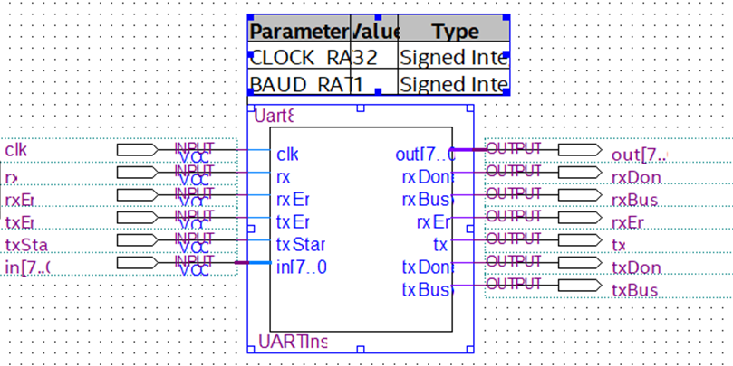
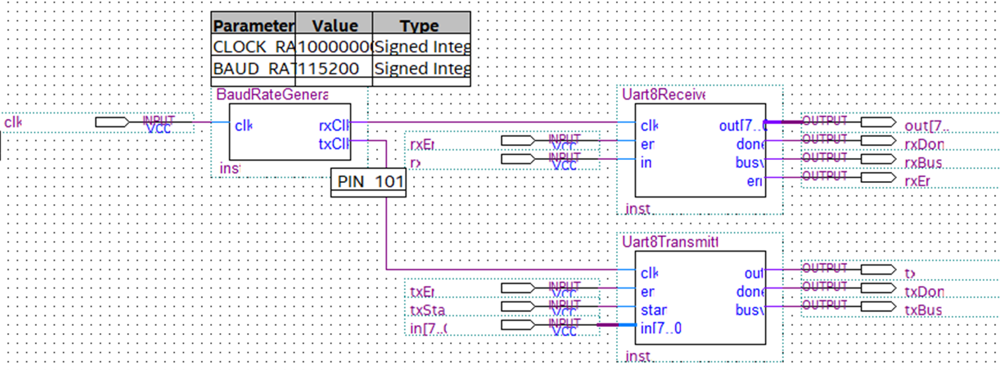
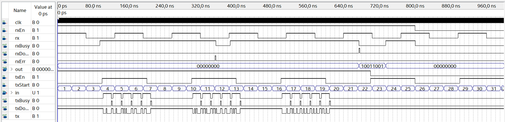
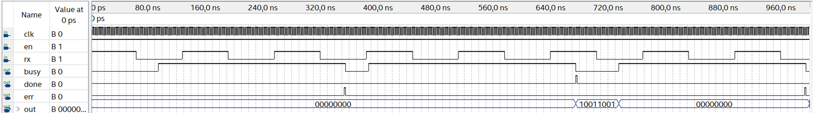
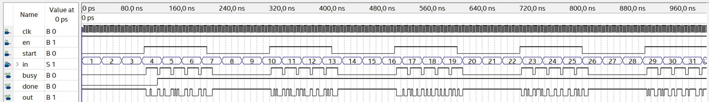
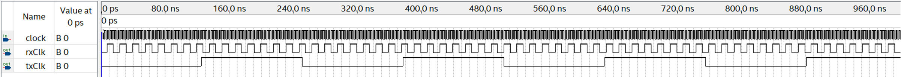

verilog-uart
============
Simple 8-bit UART realization on [Verilog HDL](https://en.wikipedia.org/wiki/Verilog).

Able to operate 8 bits of serial data, one start bit, one stop bit.

Usage
-----

### Parameters:
* `CLOCK_RATE` - board internal clock rate
* `BAUD_RATE` - target baud rate

### IO:

#### control:
* `clk` - **[input]** board internal clock

#### rx interface:
* `rx` - **[input]** receiver input
* `rxEn` - **[input]** enable/disable receiver
* `out[7..0]` - **[output]** received data
* `rxDone` - **[output]** end of transaction (1 posedge clk)
* `rxBusy` - **[output]** transaction is in progress
* `rxErr` - **[output]** transaction error: invalid start/stop bit (1 posedge clk)

#### tx interface:
* `txEn` - **[input]** enable/disable transmitter
* `txStart` - **[input]** start of transaction (1 posedge clk)
* `in[7..0]` - **[input]** data to transmit (stored inside while transaction is in progress)
* `tx` - **[output]** transmitter output
* `txDone` - **[output]** end of transaction (1 posedge clk)
* `txBusy` - **[output]** transaction is in progress

Demo
----

Uart functional modeling on:
* `CLOCK_RATE=32`
* `BAUD_RATE=1`
* `T(clk) = 0.5us`
* `T(rxEn) = 800us`
* `T(rx) = 128us`
* `T(txEn) = 700us`
* `T(txStart) = 200us`
* `T(in) = 30us` (counter inc by 1)

Receiver functional modeling on:
* `T(clk) = 1us`
* `en=1`
* `T(rx) = 144us`

Transmitter functional modeling on:
* `T(clk) = 1us`
* `en=1`
* `T(start) = 200us`
* `T(in) = 30us` (counter inc by 1)

Baud rate generator functional modeling on:
* `CLOCK_RATE=32`
* `BAUD_RATE=1`
* `T(clk) = 0.5us`

TODO
----
* testbench
* parameter to control data width
